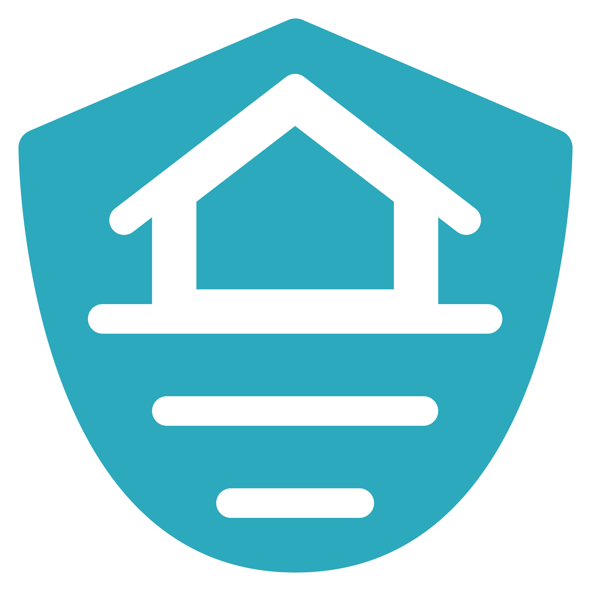

# 🌊 SafeFlood 🌊

    

**Building innovative and sustainable solutions for a safer future from flood damage.**

---

## 📖 About Us

We are **Laskar Ai (Group LAI25-SM002)**, a team dedicated to tackling the critical challenge of flood disasters in Indonesia. Our country's geography makes it highly susceptible to floods, which cause significant damage and loss. We believe **Artificial Intelligence (AI)** can greatly improve flood mitigation and management.

Our initial focus is **South Sulawesi**, a province with a high flood risk.

## 🎯 Our Mission

To develop AI-driven tools that:

- Enhance flood prediction.
- Improve early warning systems.
- Support effective disaster response.
- Contribute to community resilience and well-being.

## 👥 Meet the Team (Laskar Ai - LAI25-SM002)

| Name                         | LinkedIn Profile                          |
| :--------------------------- | :---------------------------------------- |
| Farah Putri Firdausa         | [LinkedIn](http://linkedin.com/in/farah-putri-firdausa/)   |
| Putu Gede Pradana Adnyana    | [LinkedIn](http://linkedin.com/in/pradanaadn)    |
| Ajibul Rizki                 | [LinkedIn](http://linkedin.com/in/pradanaadn)  |
| Eukardi Yanto Kristov Waruwu | [LinkedIn](http://linkedin.com/in/pradanaadn) |

---

We are passionate about using technology for good and are excited about the potential of SafeFlood.
